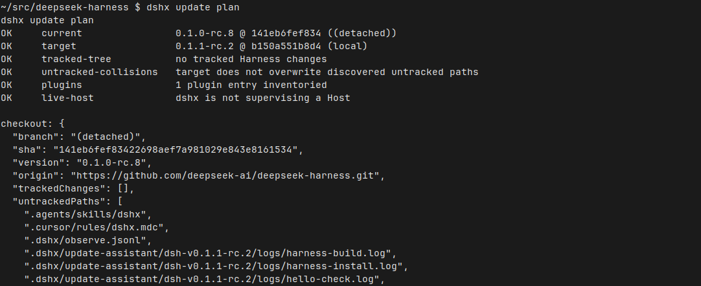
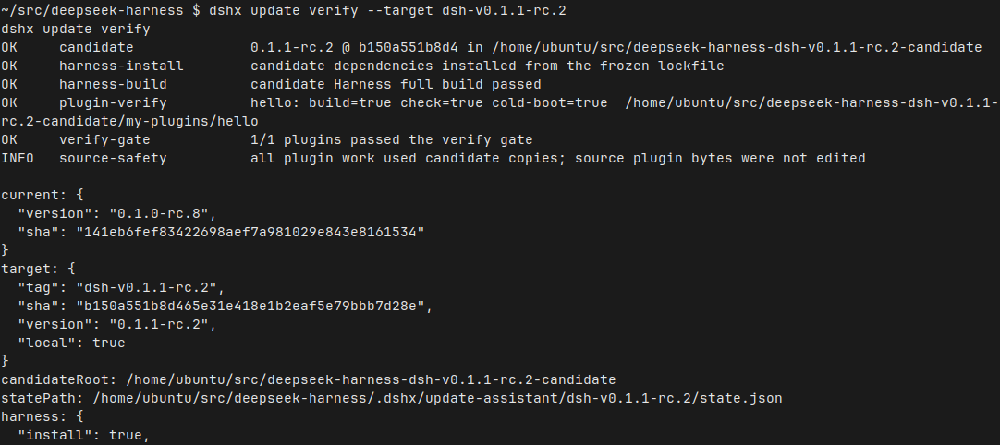

# dshx

[English](README.en.md) · [中文](README.md)

An out-of-process plugin workshop for [DeepSeek Harness](https://github.com/deepseek-ai/deepseek-harness). For Cursor, Claude Code, Codex, Grok, and humans.

Official Creator Mode is for probing a live process. dshx is the other half: write the plugin as files, check the contract, name the layer you changed, then decide whether the Host restarts or the page reloads. **It is not `dsh`, not a Harness fork, and not a Creator Mode replacement.**

0.7.4 adds a transactional update assistant: official release, candidate build, plugin cold boot, complete Web composition, and exact rollback as separate gates. It **does not** restart a production Host for you.


*2026-08-25 · machine `cursor` (Linux) · `dshx update plan` → `dshx update verify --target dsh-v0.1.1-rc.2`*

That GIF is the local CLI. The Harness checkout is `dsh-v0.1.0-rc.8` with dependencies installed, so `doctor`'s `dump-config` can run. The official Web UI was not booted. There is no official window to show. `dump-config` exiting 0 is not a boot proof.

## Install

```sh
cd /path/to/deepseek-harness
git clone https://github.com/aa2246740/dsh-external-plugin-devkit.git tools/dshx
node --import tsx/esm tools/dshx/src/cli.ts setup --harness "$PWD"
dshx which && dshx doctor
dshx update plan
```

`setup` installs a user launcher and the skill, and remembers this checkout. It does not edit Harness `package.json`, and it does not start or stop DSH. If more than one checkout is in play, pass `--harness`.

You can hand the block above to an Agent. `dshx setup --print-prompt` prints the full ask.

## What it looks like

The stills below are from the same local run. The official UI was not opened.

`setup` puts the launcher in place and leaves the Host alone:


*2026-08-25 · machine `cursor` (Linux) · `dshx setup`*

`which` names the Harness checkout and the dshx tree in use:


*2026-08-25 · machine `cursor` (Linux) · `dshx which`*

`doctor` is a workshop diagnostic. It is not official `dsh doctor` — that command does not exist:


*2026-08-25 · machine `cursor` (Linux) · `dshx doctor`*

`check` is the on-disk contract. A fresh `init` of `hello` can pass:


*2026-08-25 · machine `cursor` (Linux) · `dshx check hello`*

`activation-plan` reads disk facts, then takes one changed surface. This run chose `patch`: reconcile in place, do not restart the Host:


*2026-08-25 · machine `cursor` (Linux) · `dshx activation-plan hello --change patch`*

## 0.7.4 update assistant and RC1 Web gates

An update is more than `git pull`. The gates are staged. Without `--target`, DSHX queries the latest official `dsh-v*` release live.

```sh
dshx update plan
dshx update prepare --target dsh-v0.1.2-rc.1
dshx update verify --target dsh-v0.1.2-rc.1
dshx update apply --target dsh-v0.1.2-rc.1
dshx update rollback --target dsh-v0.1.2-rc.1
```

The screenshots below are a historical RC2 example: this machine planned `0.1.0-rc.8` → `0.1.1-rc.2`, inventoried one plugin, and was not supervising a Host. They are not proof for a current target:



*2026-08-25 · machine `cursor` (Linux) · `dshx update plan`*

`plan` / `prepare` inventory both `my-plugins` and local `file:` / `link:` plugins from the active Web profile. When both name the same package, the profile's active source wins; a missing target is reported and not replaced with a stale copy. `prepare` does a frozen install and full target-Harness build in an isolated worktree, then copies and builds every plugin. It does not switch the active checkout. During plugin builds, `DSHX_HARNESS` is pinned to the candidate so the external client adapter reads the target `platform.ts` instead of following the dshx symlink back to the active older checkout. `verify` first cold-boots a vanilla Web candidate, then runs the static contract and isolated cold boot for every candidate plugin, then starts the complete candidate Web graph. An RC1 Web page must exchange the startup URL token for its local cookie before DSHX reads `globalThis["__DSH_BOOT__"]` and each served bundle; a bare `HTTP 200/401` is not client acceptance.



*2026-08-25 · machine `cursor` (Linux) · `dshx update verify --target dsh-v0.1.1-rc.2`*

`apply` accepts only a complete candidate gate, including vanilla and combined Web gates, refuses a supervised Host, transactionally switches to `dshx/<release>`, and keeps an exact backup. `rollback` restores the pre-update branch, dependencies, and plugin `lib/`.

Keep three states distinct:

- **Upgrade complete** — checkout is on the target tag; backups live under `.dshx/update-assistant/`
- **Live runtime proof** — you ran the Host / browser and saw the behavior
- **Official activation** — the single branch from `activation-plan` actually mounted

The assistant does not restart a production Host. See [knowledge/contracts/harness-update.md](knowledge/contracts/harness-update.md).

## There is no universal hot reload

A watched patch, a next-boot bundle, a user preset, a client already on the page, a new client entry, a server module, and a copied artifact are seven different states. Keep the same DSH PID by default. A plain dependency is not `manifest` activation and not a restart reason.

```sh
dshx kb cat contracts/live-activation
dshx activation-plan <plugin> --change patch
```

## A normal day

```sh
dshx init demo --kind function
dshx check demo
dshx activation-plan demo --change patch
```

DSHX 0.7.4 treats DSH.app, direct `dsh web`, and dshx as launchers, not separate Hosts. `dshx start web` first discovers processes by their real `DSH_HOME`: it attaches to one existing Host without spawning, and fails closed on duplicates or an unproved Home. Another port and `--force` cannot bypass that gate. PID/port `EPERM` is unknown, never falsely dead or closed. `verify-boot` now uses a temporary Home while the production PID keeps running, then always stops and removes its transient Host; RC1 client-graph verification follows the startup-token-to-local-cookie request chain; `--keep` is disabled.

DSHX 0.7.3 fixes bundle-plugin removal ordering. The external supervisor runs `dshx plugin remove <package> --profile web --port <current-port>`: it removes the package from the current `__DSH_BOOT__` on the same PID before invoking the official remover, so a stale Loader graph never points at a deleted `client.js`. One exact disable stays for the lifetime of the old boot; rerunning the same command after a later normal DSH.app reopen removes it only when the new Host is proved to have booted from the clean profile. The command also resumes the dependency-gone/live-row-still-present half-removal state. Creator+ watched plugins continue to use the fixed `dshx_remove_plugin`; neither path restarts the Host or deletes source.

Use `verify-boot` only when you need an isolated cold-boot proof. Use `sync-artifact` only when a package must land in the profile — it will say `ARTIFACT_SYNCED; LIVE_ACTIVATION_UNPROVEN` and stop there.

Optional Creator Mode+ is a user preset that exposes seven fixed tools. See [knowledge/contracts/creator-mode-plus.md](knowledge/contracts/creator-mode-plus.md).

More: [start here](knowledge/start-here.md) · [why work outside Creator Mode](knowledge/why-external.md) · [command surface](knowledge/references/dshx-cli.md) · [standing orders](AGENTS.md)

## License

MIT. DeepSeek Harness is a separate project. This repo is not affiliated with DeepSeek.
