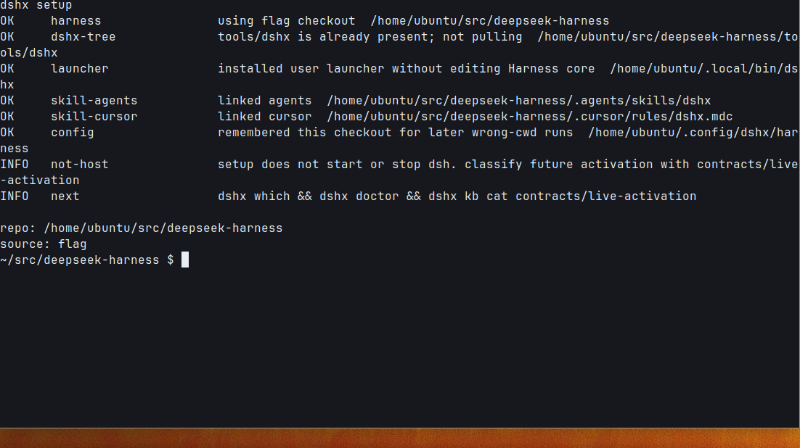
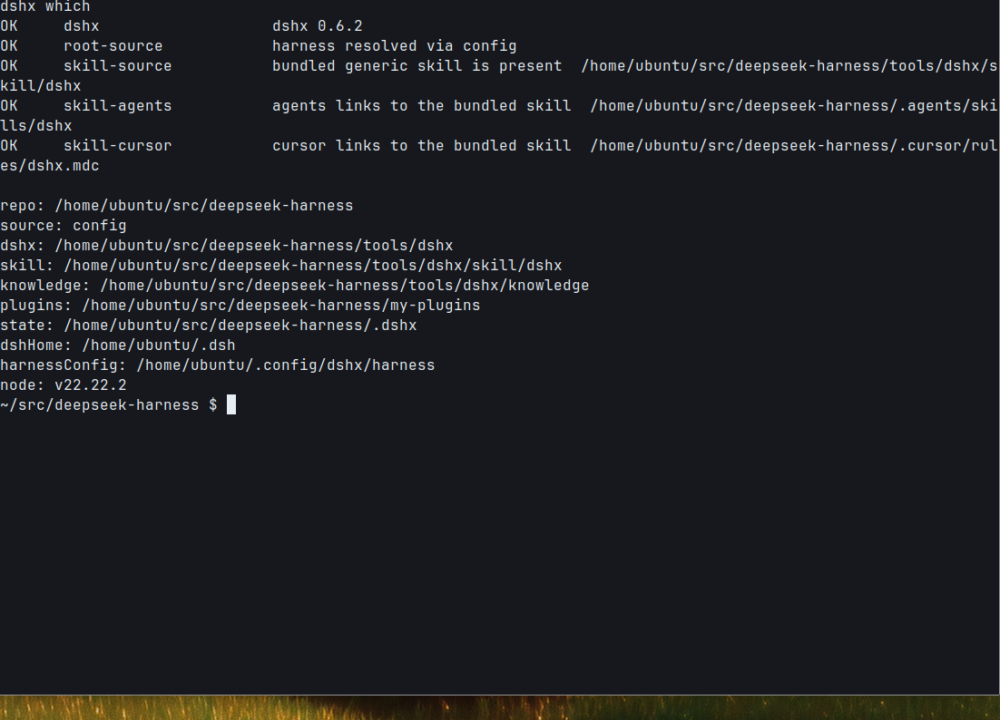
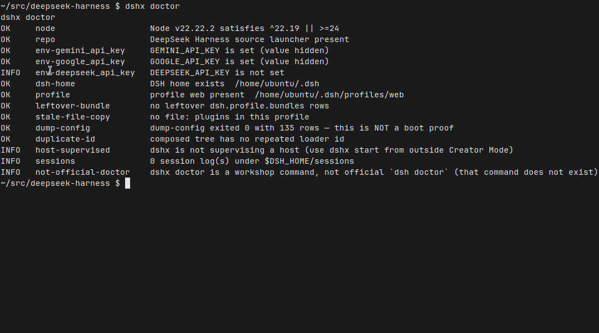
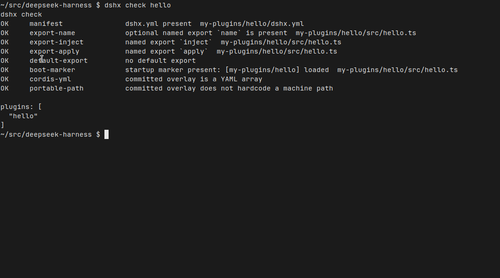
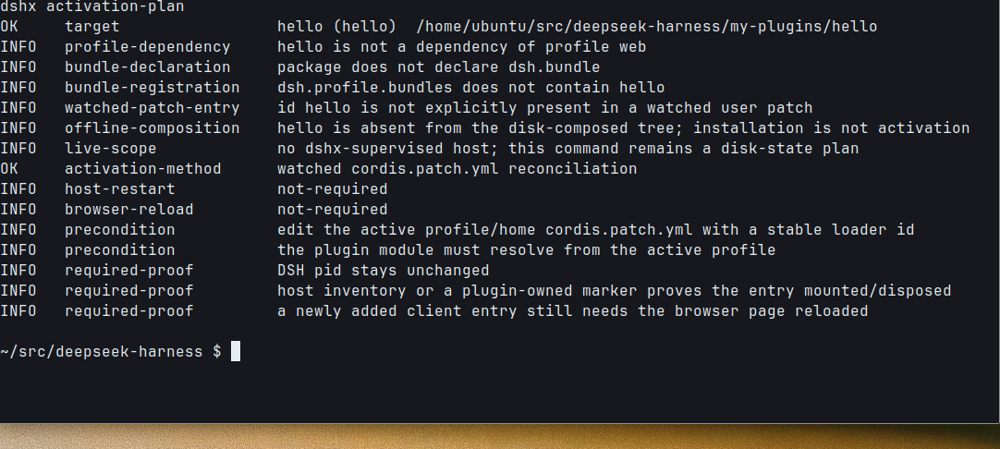

# dshx

[English](README.en.md) · [中文](README.md)

**Plugin-only boundary:** official DSH source and artifacts are read-only, including copies and worktrees. Use public extension points; missing APIs never authorize a Host patch. Takeover, approval and `--force` cannot override `CORE_SOURCE_IMMUTABLE`.

**This is not a Host feature plugin.** Do not install this repo with `dsh plugin add`. There is no Host install spec such as `github:aa2246740/dsh-external-plugin-devkit`.

If you only run official DeepSeek Harness (for example **0.2.0-rc.1**) and you are not writing plugins: **skip this repository.** Stock DSH has no Creator Mode and no DSHX. Feature-plugin install lives in that plugin's own README.

This repo is the **dshx CLI / workbench**. It is for **plugin authors who already have a [Harness checkout](https://github.com/deepseek-ai/deepseek-harness)** and want to write or maintain file-backed plugins outside the Host (Cursor, Claude Code, Codex, Grok, or a human).

Official Creator Mode is for probing a live process. dshx is the other half: write the plugin as files, check the contract, name the layer you changed, then decide whether the Host restarts or the page reloads. **It is not `dsh`, not a Harness fork, and not a Creator Mode replacement.**

0.9.2 targets official **0.2.0-rc.1**. `update plan` remains read-only; stages that modify Harness are disabled.

## 0.9.2: desk pin is 0.2.0-rc.1

The default target is `dsh-v0.2.0-rc.1` (SHA `4878cdabd87d4041bdaff61d04c966883b9fd07a`, official package `@deepseek-ai/dsh@0.2.0-rc.1`). The `@deepseek-ai/dsh` peer is `>=0.2.0-rc.1 <0.2.1`: it accepts this RC and rejects `0.2.0` alphas. Official client `INLINE_SAFE` is the same expression as `0.1.7-rc.2`.

## 0.9.1: RC2 and desktop support

0.9.1's default target was `dsh-v0.1.7-rc.2`. Desktop support covers Host identity, desktop profile selection, hot-reload transactions, and read-only profile inspection that emits row identities. Guardian leaves desktop recovery to the app.

Desktop profile installation and removal require the current Creator+ fixed tools and a Host-issued capability. The external CLI does not bypass that bridge. Validate Web and desktop profiles separately; each plugin still needs activation and behavior checks for its changed surface.

## Authors: set up the workbench

You need a local Harness checkout first. Clone this repo into that tree's `tools/dshx`, then run dshx `setup`. **Not** `dsh plugin add`.

```sh
cd /path/to/deepseek-harness
git clone https://github.com/aa2246740/dsh-external-plugin-devkit.git tools/dshx
node --import tsx/esm tools/dshx/src/cli.ts setup --harness "$PWD"
dshx which && dshx doctor
dshx update plan
```

`setup` installs a user launcher and the skill, and remembers this checkout. It does not edit Harness `package.json`, and it does not start or stop DSH. If more than one checkout is in play, pass `--harness`.

You can hand the block above to an Agent. `dshx setup --print-prompt` prints the full ask.

## What it looks like

The stills below are from the same local run. The official UI was not opened.

`setup` puts the launcher in place and leaves the Host alone:



*2026-08-25 · machine `cursor` (Linux) · `dshx setup`*

`which` names the Harness checkout and the dshx tree in use:



*2026-08-25 · machine `cursor` (Linux) · `dshx which`*

`doctor` is a workshop diagnostic. It is not official `dsh doctor` — that command does not exist:



*2026-08-25 · machine `cursor` (Linux) · `dshx doctor`*

`check` is the on-disk contract. A fresh `init` of `hello` can pass:



*2026-08-25 · machine `cursor` (Linux) · `dshx check hello`*

`activation-plan` reads disk facts, then takes one changed surface. This run chose `patch`: reconcile in place, do not restart the Host:



*2026-08-25 · machine `cursor` (Linux) · `dshx activation-plan hello --change patch`*

## Harness version inventory

`dshx update plan` reads current and target versions, working-tree state and plugin inventory. It does not prove a target build or plugin behavior.

`update prepare`, `verify`, `apply` and `rollback` are disabled with `CORE_SOURCE_IMMUTABLE`. DSHX does not create official-source candidates, rebuild or switch the Harness, or replace official files. Official application upgrades belong to a separate maintenance task. See the [plugin-only boundary](knowledge/contracts/plugin-only.md).

## There is no universal hot reload

A watched patch, a next-boot bundle, a user preset, a client already on the page, a new client entry, a server module, and a copied artifact are seven different states. Keep the same DSH PID by default. A plain dependency is not `manifest` activation and not a restart reason.

```sh
dshx kb cat contracts/live-activation
dshx activation-plan <plugin> --change patch
```

## A normal day

```sh
dshx init demo --kind function
dshx check demo
dshx activation-plan demo --change patch
```

DSHX 0.7.4 treats DSH.app, direct `dsh web`, and dshx as launchers, not separate Hosts. `dshx start web` first discovers processes by their real `DSH_HOME`: it attaches to one existing Host without spawning, and fails closed on duplicates or an unproved Home. Another port and `--force` cannot bypass that gate. PID/port `EPERM` is unknown, never falsely dead or closed. `verify-boot` now uses a temporary Home while the production PID keeps running, then always stops and removes its transient Host; RC1 client-graph verification follows the startup-token-to-local-cookie request chain; `--keep` is disabled.

DSHX 0.7.3 fixes bundle-plugin removal ordering. The external supervisor runs `dshx plugin remove <package> --profile web --port <current-port>`: it removes the package from the current `__DSH_BOOT__` on the same PID before invoking the official remover, so a stale Loader graph never points at a deleted `client.js`. One exact disable stays for the lifetime of the old boot; rerunning the same command after a later normal DSH.app reopen removes it only when the new Host is proved to have booted from the clean profile. The command also resumes the dependency-gone/live-row-still-present half-removal state. Creator+ watched plugins continue to use the fixed `dshx_remove_plugin`; neither path restarts the Host or deletes source.

Use `verify-boot` only when you need an isolated cold-boot proof. Use `sync-artifact` only when a package must land in the profile — it will say `ARTIFACT_SYNCED; LIVE_ACTIVATION_UNPROVEN` and stop there.

DSHX 0.9.2 includes a Creator Mode+ user preset with nine fixed tools. Standalone Creator+ 0.3.8 adds `dshx_browser_open` for ten. On a claim conflict, call `dshx_request_takeover` in the current conversation; explicit user confirmation stops old work before transferring ownership. See [knowledge/contracts/creator-mode-plus.md](knowledge/contracts/creator-mode-plus.md).

More: [start here](knowledge/start-here.md) · [why work outside Creator Mode](knowledge/why-external.md) · [command surface](knowledge/references/dshx-cli.md) · [standing orders](AGENTS.md)

## License

MIT. DeepSeek Harness is a separate project. This repo is not affiliated with DeepSeek.

## Browser authentication and Agent tests

Use `dshx browser status` to check the existing Host. External `browser bind` accepts an official startup URL privately through `DSHX_WEB_STARTUP_URL`; Creator watch/claim refreshes this handoff automatically. `browser open` uses `DSHX_BROWSER_ADAPTER`, an explicit executable receiving private JSON on stdin. See [browser access](knowledge/contracts/browser-access.md) for launcher coverage, expiry, adapter protocol, and the shipped Codex two-context smoke test. HTTP authentication, an authenticated browser run, and feature acceptance are separate.
