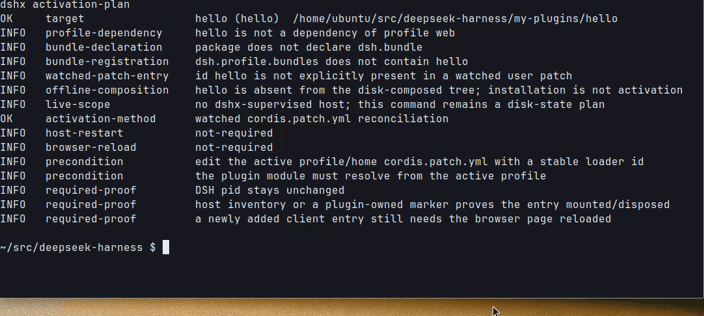
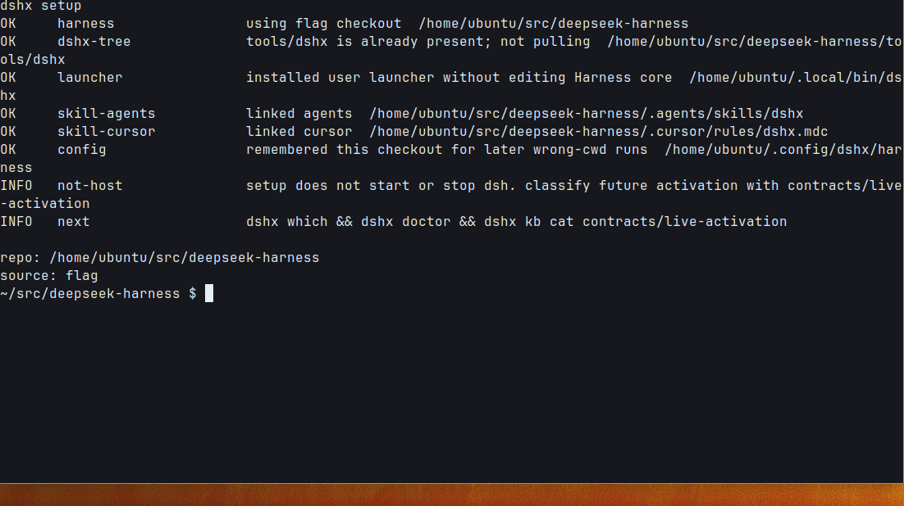
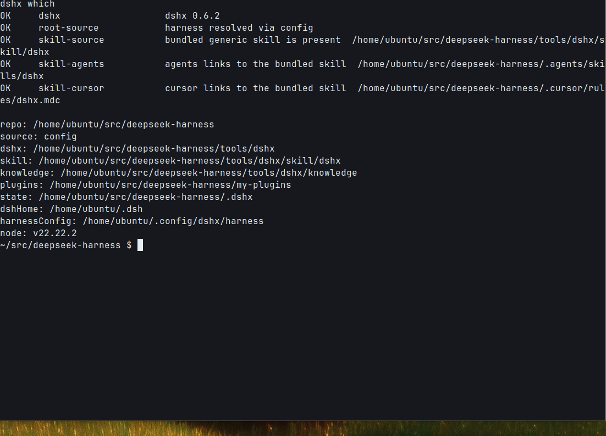
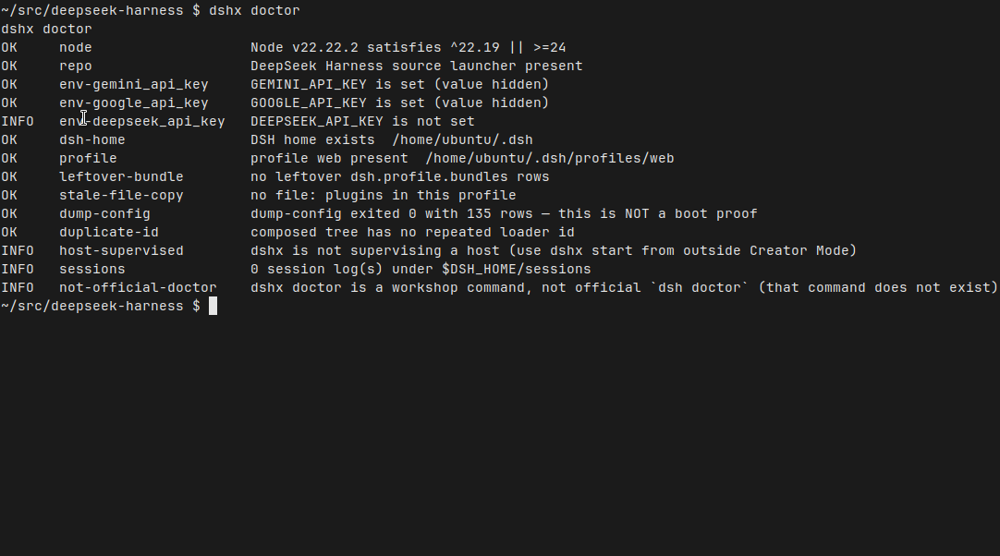
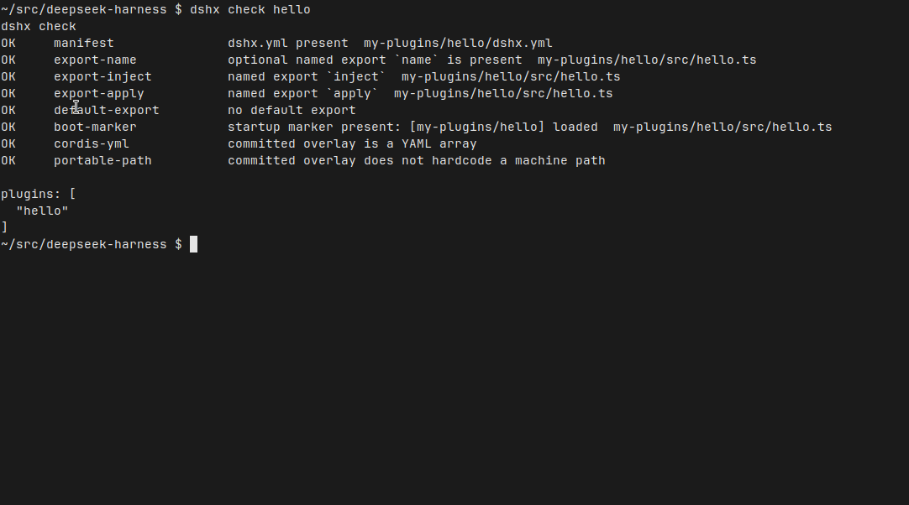
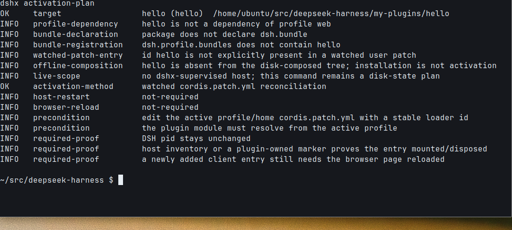

# dshx

[中文](README.md) · [English](README.en.md)

DeepSeek Harness 的进程外插件工作台。给 Cursor、Claude Code、Codex、Grok 和人用。

官方 Creator Mode 适合在活进程里探针。dshx 管另一半：把插件写成文件、检查合同、看这次改的是哪一层，再决定要不要重启 Host、刷新页面。它不是 `dsh`，不是 Harness 的 fork，也不是一包现成插件。



上面是本机刚跑过的 CLI。这台机器有一份 DeepSeek Harness 源码，依赖也装上了，所以 `doctor` / `activation-plan` 能跑 `dump-config`。官方 Web UI 没有起来，所以没有官方窗口。

## 装上就能用

```sh
cd /path/to/deepseek-harness
git clone https://github.com/aa2246740/dsh-external-plugin-devkit.git tools/dshx
node --import tsx/esm tools/dshx/src/cli.ts setup --harness "$PWD"
dshx which && dshx doctor
```

`setup` 只装用户 launcher 和 skill，记住这个 checkout。不改 Harness 的 `package.json`，也不启停 DSH。

多个 checkout 同时在场时，加上 `--harness`，不要让工具猜。

把上面这段交给 Agent 也行；`dshx setup --print-prompt` 会打出完整说明。

## 它实际长这样

下面五张也是同一次本机演示。`dump-config` 通过了——这不是 boot 证明，官方界面也没开。

`setup` 装好 launcher，不碰 Host：



`which` 说出这次用的是哪份 Harness、哪份 skill：



`doctor` 是工作台诊断，不是官方 `dsh doctor`（那个命令不存在）：



`check` 看的是落盘合同。刚 `init` 出来的 `hello` 可以通过：



`activation-plan` 只读盘上事实，然后只选一个变更面。这次是 `patch`：热重组，不重启 Host：



## 没有万能热重载

改 watched patch、下次启动的 bundle、用户 preset、已经在页面里的 client、新的 client 入口、服务端模块，或只是拷了产物——这七种不是同一个动作。先读合同，再让 `activation-plan` 选一条分支：

默认保持同一个 DSH PID，并按真正要改变的运行时表面分类。普通 profile dependency 只是解析前提，不是 `manifest` activation，也不是重启理由；首次 Web client 即使写入 dependency，仍走 `new-client`，Host 热挂后只刷新/重开页面。只有启动时捕获的 bundle composition 或没有专项 HMR 的 server module 才授权重启。

```sh
dshx kb cat contracts/live-activation
dshx activation-plan <plugin> --change patch
```

完整矩阵在 [knowledge/contracts/live-activation.md](knowledge/contracts/live-activation.md)。

## 日常怎么走

```sh
dshx init demo --kind function
dshx check demo
dshx activation-plan demo --change patch
```

## Harness 更新助手

更新不是一次 `git pull`。DSHX 0.7.0 把官方 release、Harness 构建、全部本地插件和精确回滚放进一个分阶段门禁：

```sh
dshx update plan
dshx update prepare --target dsh-v0.1.1-rc.2
dshx update verify --target dsh-v0.1.1-rc.2
dshx update apply --target dsh-v0.1.1-rc.2
```

- `plan` 只读官方 `dsh-v*` tag、当前 checkout、tracked dirty 风险、目录与 symlink 插件清单。
- `prepare` 在隔离 worktree 冻结安装并完整构建目标 Harness，再复制和构建全部插件；不切换当前 Harness。
- `verify` 对每个候选插件执行静态合同和隔离冷启动。RC2 Web 客户端走原生 profile 包解析，同时证明启动图条目与 `client.js` 200；服务端-only 插件证明 `apply()` marker。
- `apply` 只接受完整候选门禁，拒绝正在监督的 Host，事务化切到 `dshx/<release>`、重建实际插件，并保存 checkout、依赖树和插件 `lib/` 的精确备份。
- `rollback` 恢复升级前分支、依赖与插件生成物：`dshx update rollback --target <release>`。

省略 `--target` 时会实时查询官方最新 release。更新助手不会替你重启正式 Host；升级完成、真实运行时验收和正式激活仍是三个不同状态。详细合同见 [knowledge/contracts/harness-update.md](knowledge/contracts/harness-update.md)。

DSHX 0.7.2 在 0.7.1 的 RC8/RC2 新 client 验证兼容上补齐安全卸载：`dshx_remove_plugin` 先让同 PID Host 脱载，再清 profile，只断开经目标校验的 symlink 并保留源码。RC8 若删了 dependency 却遗留本插件的 `node_modules` symlink，会从 durable quarantine 续跑并安全解绑；目录、越界目标或无法证明的状态仍失败关闭。Creator 会话直接拆插件根、Harness link 或 active profile 会被拒绝；Guardian 还会在已认领插件的 profile link 消失、Host 尚健康时主动隔离 stale row，避免下次冷启动失败。

需要隔离冷启动证明时才 `verify-boot`。需要把包装进 profile 时才 `sync-artifact`——它只会告诉你 `ARTIFACT_SYNCED; LIVE_ACTIVATION_UNPROVEN`。

可选的 Creator Mode+ 是一个用户 preset，只暴露七个固定工具。见 [knowledge/contracts/creator-mode-plus.md](knowledge/contracts/creator-mode-plus.md)。

更多：[从这里开始](knowledge/start-here.md) · [为什么出仓](knowledge/why-external.md) · [命令一览](knowledge/references/dshx-cli.md) · [站岗说明](AGENTS.md)

## 许可

MIT。DeepSeek Harness 是另一个项目。这里和 DeepSeek 没有隶属关系。
